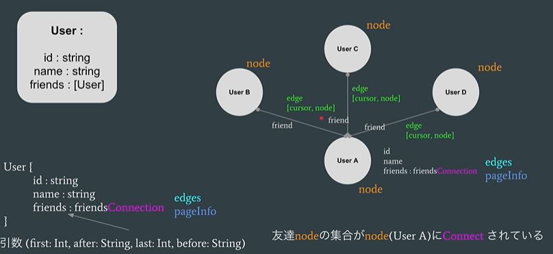
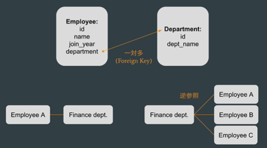

# GraphQL

- サーバから必要なデータを必要な分だけ、過不足なく取得する
- 1度のリクエストから複数リソースのデータを取得
- 型が決まっている

## REST API の課題

- 過剰な取得（使わない属性も取得する）
- 過少な取得（ネストした情報を取るには複数エンドポイントから取得要）
- (拡張時に) End point の追加

## GraphQL用語

- query：SELECT
- mutation：INSERT/UPDATE/DELETE
- subscription：サーバ側の変化を監視

## Relay Server Specification

GraphQL拡張機能。（Github API v4も準拠）

- Relay Node (Globally unique ID)
- Relay Connection (Edge, Node, cursor based pagination)
- Relay Mutation 

https://relay.dev/docs/guides/graphql-server-specification/

### Node, Edge, Connection



### Pagination

pageInfo
- hasNext: boolean!
- hasPreviousPage: boolean!
- startCursor: string
- endCursor: string

# Practice

## server

djangoプロジェクト作成

```
pip install Django
pip install django-cors-headers
pip install graphene-django
pip install django-graphql-jwt
pip install django-filter
```

```
django-admin startproject employees .
django-admin startapp api
django-admin startapp users
```

https://docs.graphene-python.org/projects/django/en/latest/tutorial-relay/

以下を追加

```py
from datetime import timedelta

INSTALLED_APPS = [
  # :
  'graphene_django',
  'api.apps.ApiConfig',
  'users.apps.UsersConfig',
  'corsheaders', 
]

MIDDLEWARE = [
  'corsheaders.middleware.CorsMiddleware',
  # :
]

GRAPHQL_JWT = {
  'JWT_VERIFY_EXPIRATION': True,
  'JWT_EXPIRATION_DELTA': timedelta(minutes=60),
}

CORS_ORIGIN_WHITELIST = [
    'http://localhost:3000',
]

# DATABASESの下に
GRAPHENE = {
    'SCHEMA': 'employees.schema.schema',
    'MIDDLEWARE': [
      'graphql_jwt.middleware.JSONWebTokenMiddleware',
    ],
}

# JWT の認証を使えるようにする
AUTHENTICATION_BACKENDS = [
  'graphql_jwt.backends.JSONWebTokenBackend',
  'django.contrib.auth.backends.ModelBackend',
]
```

### models



- 1対多（ForeignKey）
- 逆参照のフィールド名変更：`related_name` (デフォルト名：`employee_set`)

```py
 department = models.ForeignKey(Department, related_name='employees', on_delete=models.CASCADE, blank=True,  null=True)
```

apis/admin.py に追加
```py
admin.site.register(Employee)
admin.site.register(Department)
```

INSTALLED_APPS に models.pyのパッケージ名も追加要

```
python manage.py makemigrations
python manage.py migrate
python manage.py createsuperuser
```

super/super

http://localhost:8000/admin からモデルの確認ができる

### Schema

apis/schema.py 作成


### Mutation

作成/更新/削除操作

## Front

```sh
# npm i @material-ui/core @material-ui/icons --legacy-peer-deps
npx create-react-app --template typescript .
npm i @mui/core @mui/icons-material @mui/material 
npm i @emotion/react @emotion/styled
npm i react-router-dom
npm i @apollo/react-hooks
# npm i @apollo/client@3.6.0 --legacy-peer-deps
npm i graphql
npm i jwt-decode
```

https://github.com/apollographql/invariant-packages/issues/279
